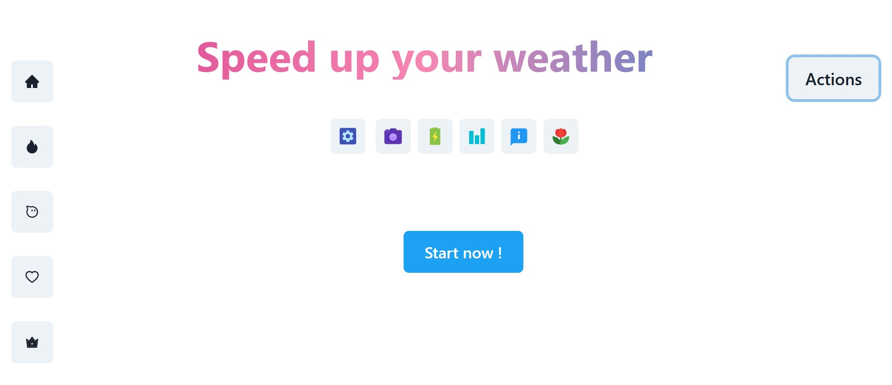
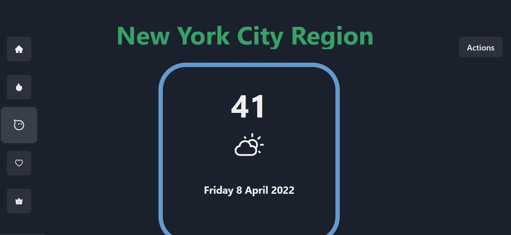

# Discord style weather app from the 5 biggest cities of America
## Description
This is a lean and beautiful weather App which displays the current weather of the 5 biggest
cities of America. It uses the Air now API for this.

It has a beautiful navbar , a dark mode switch and uses routing to make it
extremely fast. 🏃

## Snapshots

## Install , run
git clone "url of the repo" cd my-cloned-app

npm install npm start

//localhost:3000

## Technologies
React ( w. create-react-app)
Chakra ui ( ui library)
Framer Motion ( animation library)
API1: Air now (must create account, can use different api)

## Usage
Use the code whenever , wherever you want. No credits needed !  ✌️